# Inningz

Inningz is a modern cricket web application that delivers real-time scores, full scorecards, ball-by-ball commentary, rich analytical charts, match forecasts, player profiles, and ICC rankings. Built with Next.js 15 and designed mobile-first for fans who want fast, deep match coverage without logins or ads.

Data is scraped on demand from publicly available Cricbuzz endpoints and rendered through a responsive, glass-card interface with six theme variants, progressive skeletons, and PWA support.

[Live demo](https://inningz.vercel.app)

<p align="center">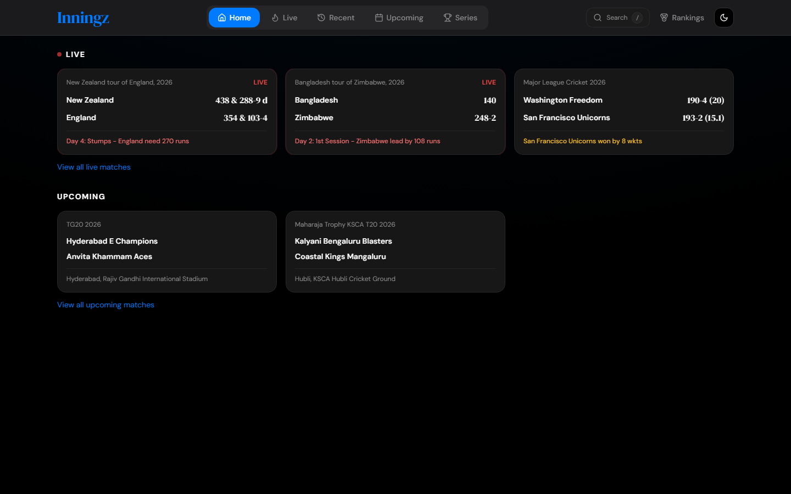</p>

---

## Screenshots

<table width="100%">
  <tr>
    <td width="50%" align="center">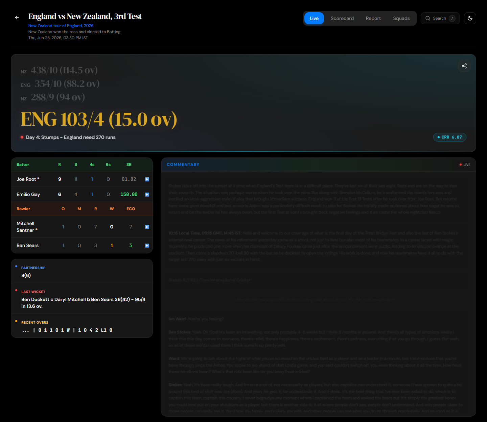<br><sub>Match · Live</sub></td>
    <td width="50%" align="center">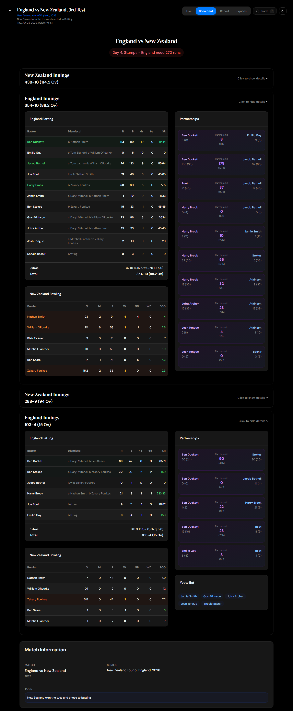<br><sub>Match · Scorecard</sub></td>
  </tr>
  <tr>
    <td align="center">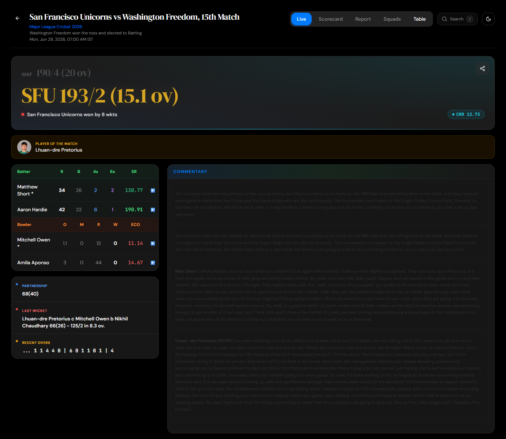<br><sub>Match · T20 league</sub></td>
    <td align="center">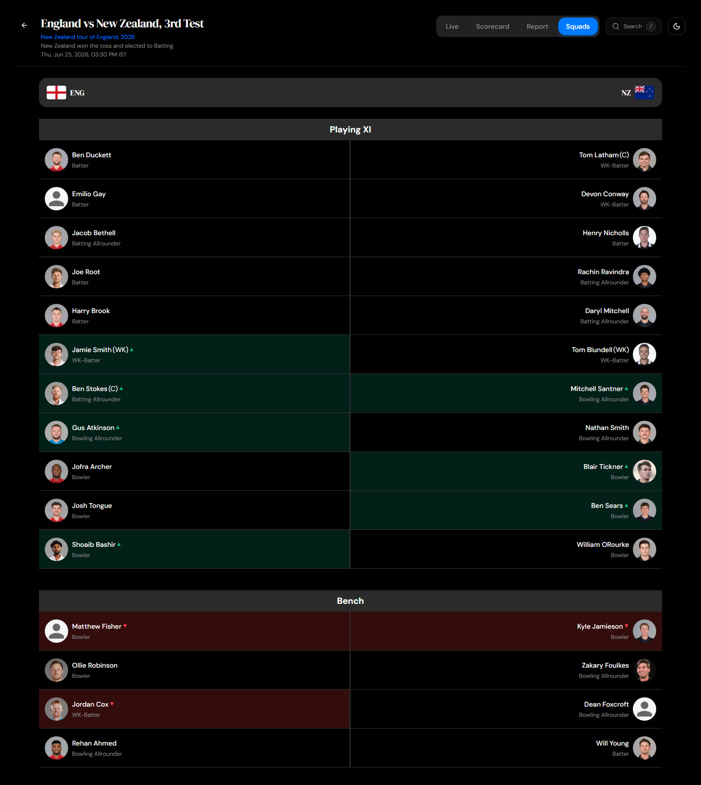<br><sub>Match · Squads</sub></td>
  </tr>
  <tr>
    <td align="center">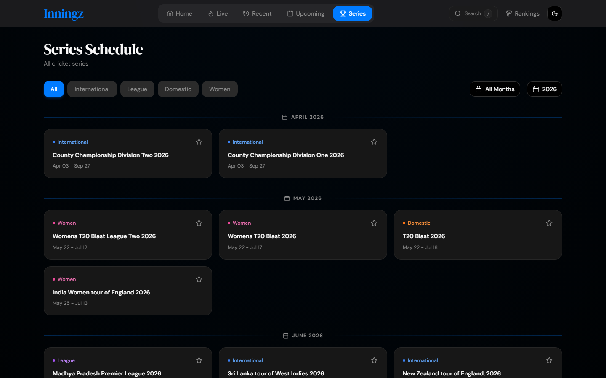<br><sub>Series schedule</sub></td>
    <td align="center">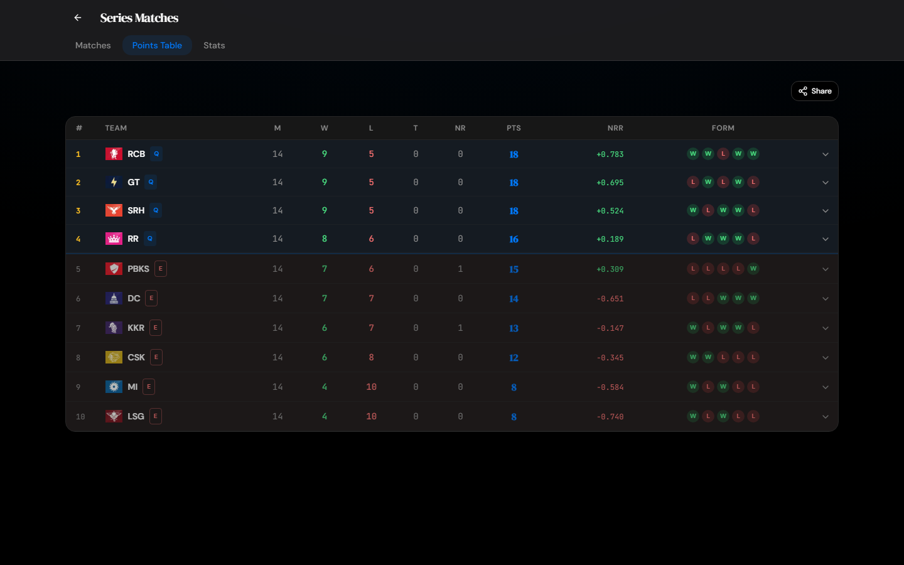<br><sub>Points table</sub></td>
  </tr>
  <tr>
    <td colspan="2" align="center">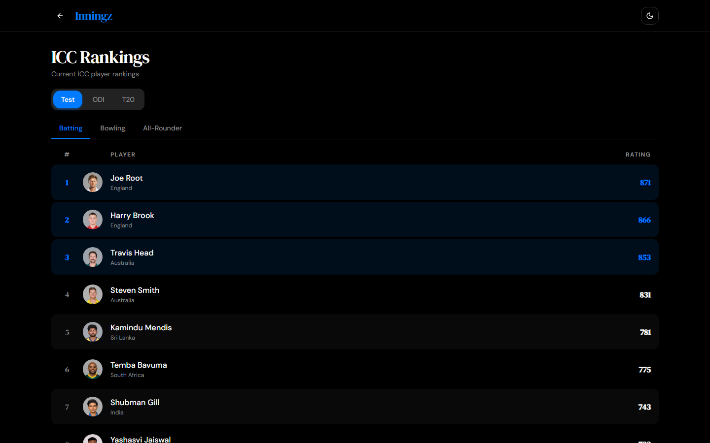<br><sub>ICC rankings</sub></td>
  </tr>
</table>

### Report tab analytical charts

<table width="100%">
  <tr>
    <td width="50%" align="center">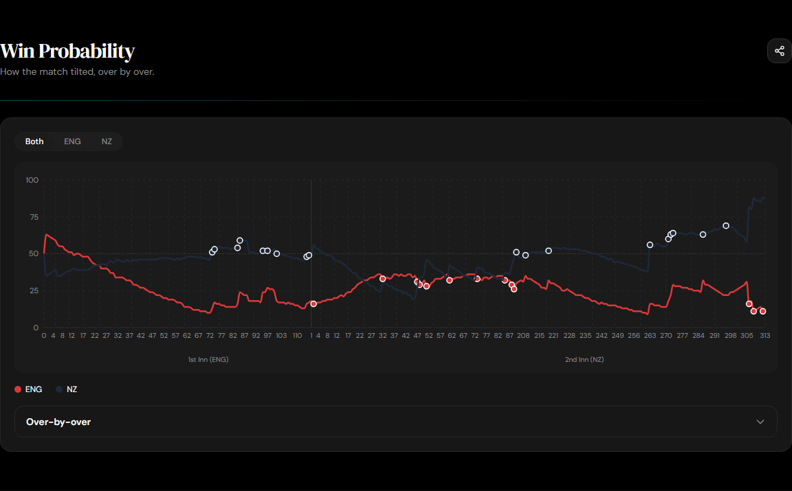<br><sub>Win Probability</sub></td>
    <td width="50%" align="center">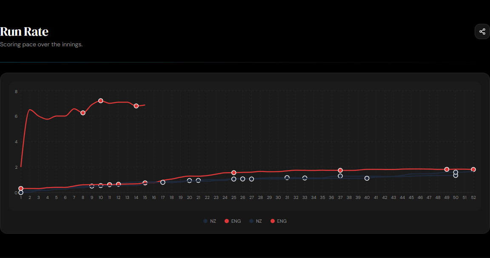<br><sub>Run Rate</sub></td>
  </tr>
  <tr>
    <td align="center">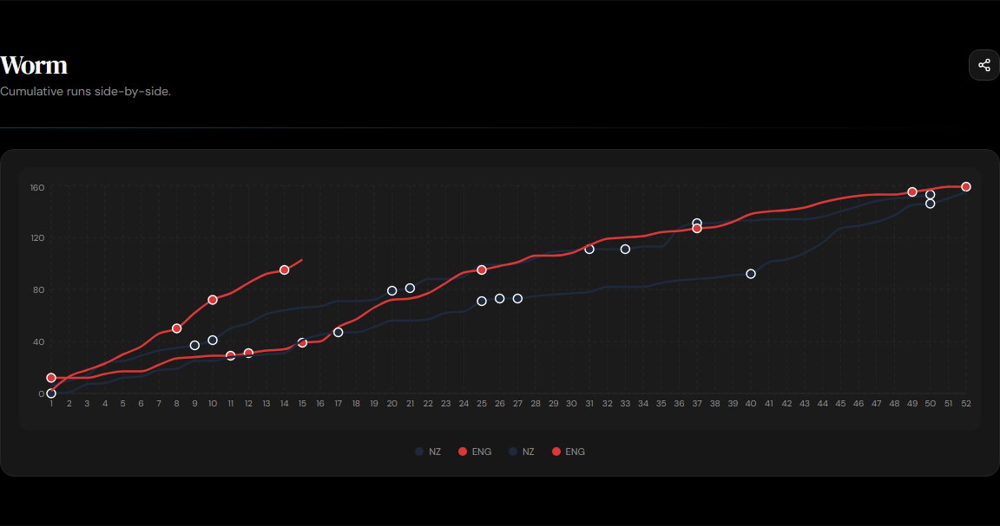<br><sub>Worm</sub></td>
    <td align="center">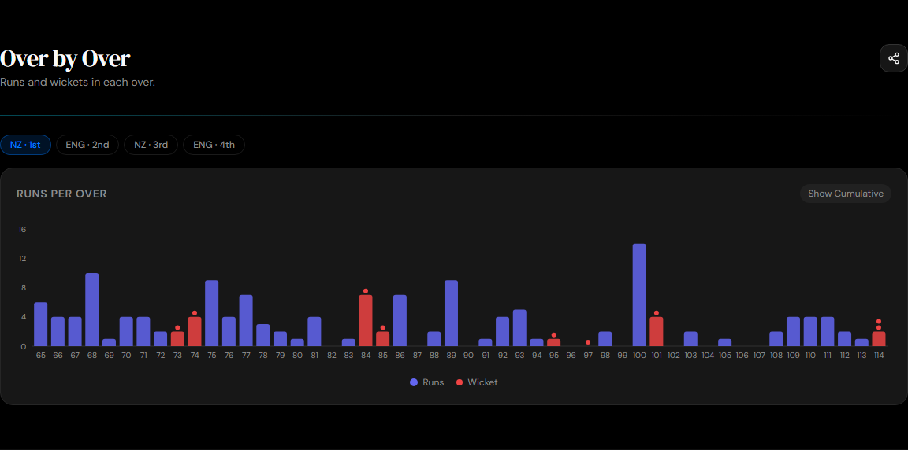<br><sub>Over by Over</sub></td>
  </tr>
  <tr>
    <td align="center">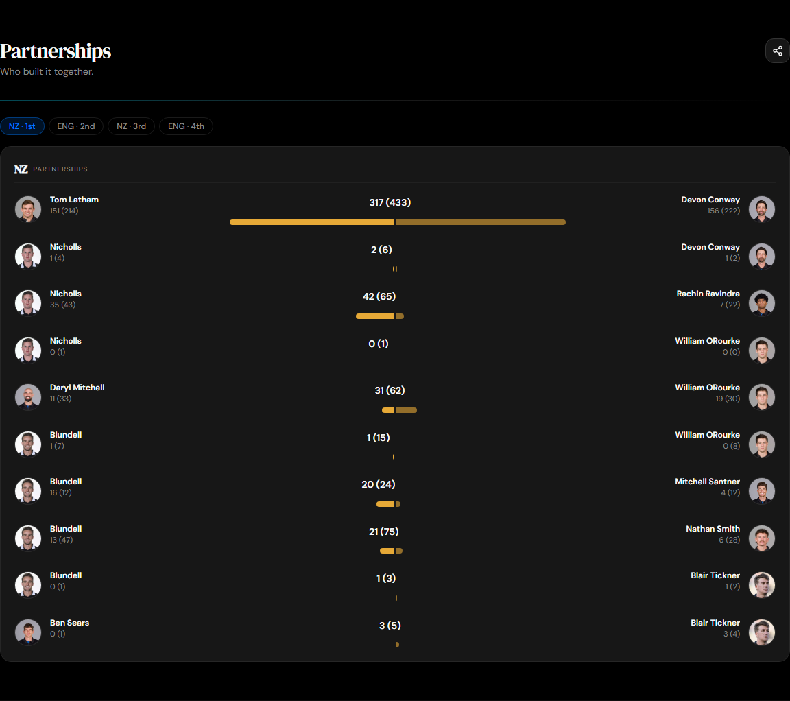<br><sub>Partnerships</sub></td>
    <td align="center">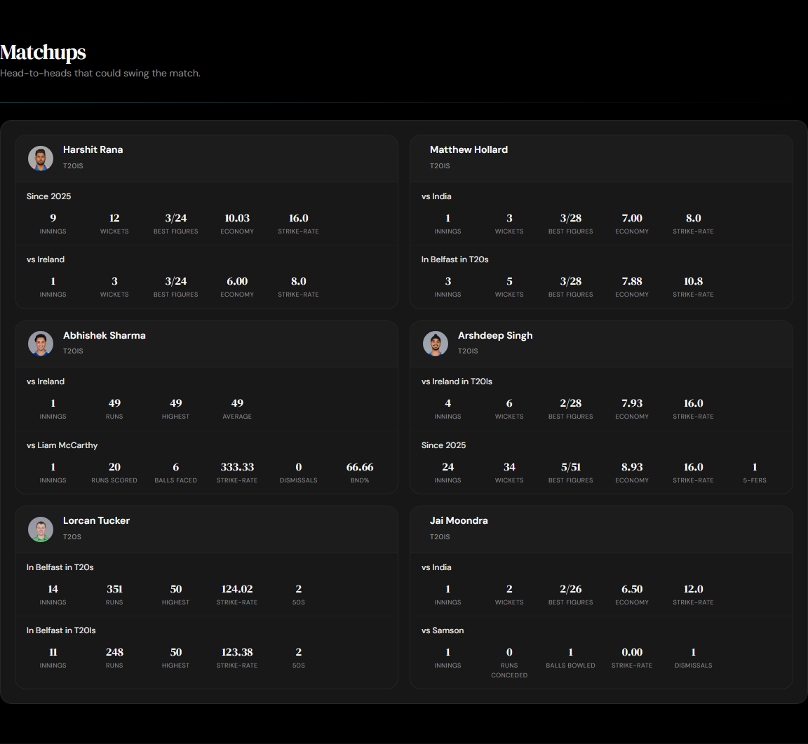<br><sub>Matchups</sub></td>
  </tr>
</table>

<p align="center">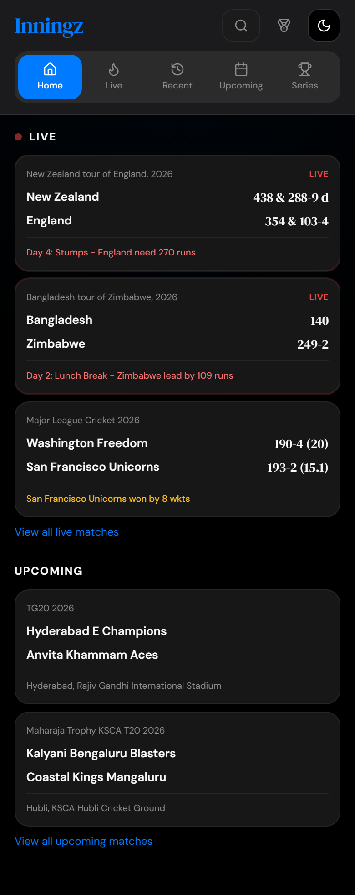<br><sub>Mobile home</sub></p>

Screenshots are generated by `npm run screenshots` (see [Available scripts](#available-scripts)) against the deployed app.

---

## Features

### Home Dashboard

- Tabbed browsing for Live, Recent, and Upcoming matches with category filters for International, League, Domestic, and Women's cricket.
- Series-grouped match listings and quick access to series schedules.
- Recent history strip showing the last matches, series, and players the user has visited.
- Global search palette (see below) and a rankings entry point.

### Match Page

The match page is organized into five tabs in a fixed order: Live, Scorecard, Report, Squads, and Points Table (shown only for tournament matches). Tabs support touch swipe, mouse drag, arrow keys, and number-key shortcuts (`1`–`5`).

#### Live tab

**Real-time updates**
- Server-Sent Events for score updates with a 10-second polling fallback and exponential backoff on failure.
- Countdown timer for upcoming matches.

**Score display**
- Hero score card with previous innings, current score, live run rate, required run rate, last-event badge (W, 4, 6), and share button.
- Quick-score floating widget that slides in when the hero score scrolls out of view.
- Haptic feedback (`navigator.vibrate`) on wickets, sixes, and fours for supported devices.

**Batting & bowling tables**
- Batting table with striker/non-striker, runs, balls, fours, sixes, strike rate.
- Bowling table with overs, maidens, runs, wickets, economy.

**Commentary**
- Ball-by-ball commentary with per-over summary cards showing the ball sequence, total runs, batters' scores, and bowler figures.
- "After this over" bottom sheet with a full over breakdown and live win-probability bar.
- Virtualised commentary list that stays smooth across thousands of balls.

**Extras**
- Player-of-the-match and player-of-the-series badges linking to full profiles.
- Integrated live stream tab with HLS.js playback, multi-source fallback, and proxied streams.

#### Scorecard tab

- Innings-by-innings batting and bowling tables with career-stat row highlighting for fifties, hundreds, and multi-wicket spells.
- Fall of wickets, extras breakdown, and inning totals.
- Click any player name to open their full profile in a dialog.

#### Report tab

A nine-section analytical report, each section lazy-loaded on scroll using IntersectionObserver with a 300px preload margin. Sections hide entirely if the underlying data is missing, so every visible panel is meaningful.

1. **Win Probability**: line chart of the per-over win probability for both teams with an innings break reference line, wicket markers, and hoverable over-by-over bars.
2. **Run Rate**: line chart of the scoring pace across the innings, colour-coded by team.
3. **Worm**: cumulative runs side-by-side with a toggle for both innings.
4. **Over by Over**: bar chart of runs and wickets per over with a show/hide cumulative toggle.
5. **Partnerships**: horizontal stacked bar chart per innings, with batter-pair labels.
6. **Ball Map**: every delivery in an innings rendered as a coloured pill (four, six, wicket, wide, no-ball, dot, legal runs), with a mobile wrap so long overs never overflow.
7. **Matchups**: head-to-head cards pulled from Cricbuzz's match-forecast API, showing relevant bowler-vs-batter and team-vs-team statistics.
8. **Venue**: ground details, pitch notes, expected runs, pace-vs-spin and phase-split stat cards, and a clickable list of recent matches at the venue.
9. **All Players**: squad grouped by role (wicket-keepers, batters, all-rounders, bowlers) with avatars, team tags, style labels, expert descriptions, and a collapsible legend of badge meanings (in form, ideal for conditions, injured, off-field pick).

Every section uses a shape-matched skeleton loader while fetching, and the section title is itself a skeleton until the fetch resolves so users never see a header for data that may not exist.

#### Squads tab

- Two-column mirrored layout of each team's playing XI with avatars, captain and wicket-keeper indicators, and in/out markers showing changes from the previous match.
- Separate bench section when applicable.
- Click any player to view their profile.

#### Points Table tab

- Group-aware points table with team logos, matches played, wins, losses, ties, NRR, form indicators, and last-five results.
- Top performers card showing most runs and most wickets in the tournament.

### Player Profile

**Overview**
- Personal information: born, birthplace, height, role, batting and bowling styles, teams.
- Player bio and biography.

**Stats & rankings**
- Career statistics across Test, ODI, T20I, and IPL formats.
- Career summary tables with format-wise batting and bowling breakdowns.
- ICC rankings for batting, bowling, and all-rounder with best-rank history.

**Form**
- Recent form tab showing the last innings with batting/bowling switching.

Opened inside a dialog from match pages or directly from the command palette.

### Series Pages

- Series match schedules and fixtures by month.
- Series statistics (most runs, most wickets, highest strike rate, etc.) with format filters.
- Points tables with group support and top-performer cards.
- Team filter across the series.

### ICC Rankings Page

- Dedicated rankings for Test, ODI, and T20I formats.
- Batting, bowling, and all-rounder categories.
- Paginated player tables with rank, country, rating, and profile links.

### Command Palette

- Global palette triggered with the `/` key on desktop and via the search button in the header.
- Searches matches (currently live and recent from the live-scores context) and series (full schedule).
- Keyboard navigation with `↑`/`↓` and `Enter`; `Esc` to close.
- Auto-focuses the input on desktop but skips focus on touch devices (`pointer: coarse`) so the soft keyboard does not pop up unexpectedly.

### Sharing

- One-click share card for the current match: team flags, score, status, run rates, previous innings, and win probability, rendered client-side with `html-to-image` and exported as PNG.
- Stat-snippet share for commentary lines: pick any stat or commentary highlight and generate a shareable card.
- Floating share button on the score hero.

### Theming

- Six themes: Light, Dark, Midnight, Pitch, Sunset, and Sepia, plus System preference.
- `next-themes` with class-based switching, no flash on hydration, and persistence across sessions.
- Glassmorphism card system with backdrop blur, subtle gradient borders, and theme-aware accent colours.

### Progressive Web App

- Web App Manifest with icons, splash screen, portrait orientation, and standalone display mode.
- iOS home-screen support with black-translucent status bar.
- Service worker registration for offline shell caching.

---

## Tech Stack

| Category | Details |
|---|---|
| Framework | Next.js 15 (App Router, Server Actions, streaming) |
| Language | TypeScript 5.9 |
| Runtime | React 18, Node.js 18+ |
| Styling | Tailwind CSS 3.4, CSS variables for theming |
| UI Primitives | Radix UI, shadcn/ui |
| Charts | Recharts 2 |
| Scraping | Cheerio |
| Validation | Zod |
| Forms | React Hook Form |
| Theming | next-themes |
| Real-time | EventSource (SSE) with polling fallback |
| Video | HLS.js |
| Image export | html-to-image |

---
### No database, no auth

Inningz intentionally runs without a database or user accounts. All personalisation (recent history, favourites, preferences) is stored in `localStorage`, and all data is scraped on demand. This keeps the surface area small and the infrastructure stateless, at the cost of not supporting cross-device sync.

---

## Routes

### Pages

| Path | Description |
|---|---|
| `/` | Home dashboard with live, recent, and upcoming matches. |
| `/match/[matchId]` | Match page with Live, Scorecard, Report, Squads, and Points Table tabs. |
| `/series/[...seriesPath]` | Series page with schedule, stats, points table, and team filters. |
| `/rankings` | ICC rankings for Test, ODI, and T20I across all categories. |

---

## Getting Started

### Prerequisites

- Node.js 18 or later
- npm, yarn, or pnpm

### Installation

```bash
git clone https://github.com/vanshaj-pahwa/Inningz.git
cd Inningz
npm install
npm run dev
```

Open `http://localhost:3000` in your browser.

No environment variables or API keys are required for the core cricket functionality. An optional token is needed only if you want to proxy ICC live streams through the app; see the stream fetcher in `src/lib/stream-fetcher.ts`.

---

## Available scripts

| Script | What it does |
|---|---|
| `npm run dev` | Start the Next.js dev server at `http://localhost:3000`. |
| `npm run build` | Production build. |
| `npm start` | Run the production build. |
| `npm run lint` | Run `next lint`. |
| `npm run typecheck` | Run `tsc --noEmit`. |
| `npm run screenshots` | Capture the screenshots in [`docs/screenshots/`](docs/screenshots) used in this README. |

### Screenshots script

`scripts/screenshots.mjs` uses Playwright Chromium to capture the home page, all tabs, the rankings page, several match views (Live / Scorecard / Report / Squads), the series detail and points table, and a mobile-viewport shot of the home.

```bash
# Default target is the deployed site
npm run screenshots

# Or point it at your local dev server
INNINGZ_URL=http://localhost:3000 npm run screenshots
```

Match IDs and series slugs are listed at the top of the script. Swap them as matches finish so the README stays representative.

---

## Contributing

1. Fork the repository.
2. Create a feature branch: `git checkout -b feature/your-feature`.
3. Commit your changes with a conventional prefix: `git commit -m "feat: add something"`.
4. Push the branch: `git push origin feature/your-feature`.
5. Open a pull request describing the change and the motivation.

For bug reports, please include the match ID or route, the browser, and any console output. For scraping-related breakages, it helps to attach a snippet of the Cricbuzz HTML or JSON response that triggered the bug.

---

## License

MIT License. See [LICENSE](LICENSE) for details.

---

## Acknowledgements

Inningz consumes publicly available data from Cricbuzz. It is a fan project and is not affiliated with, endorsed by, or sponsored by Cricbuzz, the BCCI, the ICC, or any cricket board or league.
